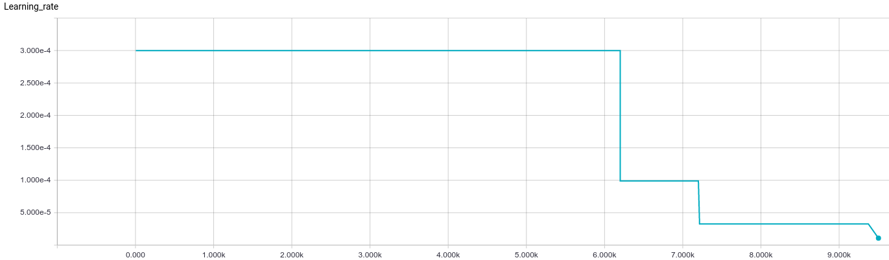
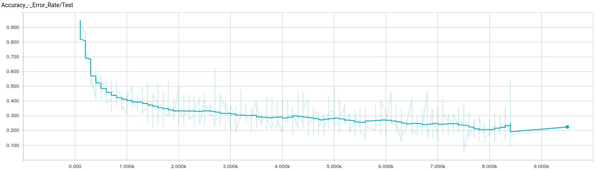
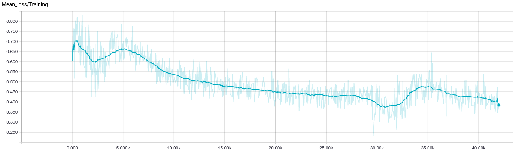

# English pre-trained model

This directory contain a trained english acoustic model (42.000 steps of 10 files batches).
This is still work in progress, far from perfect, but it give some insight on the current state of the software.

### Dataset

The dataset was built using [Shtooka](http://shtooka.net/) and [LibriSpeech](http://www.openslr.org/12/) datasets

Training set contains :
* LibriSpeech's train-clean-100
* LibriSpeech's train-clean-360
* Shtooka's eng-balm-emmanuel_flac.tar
* Shtooka's eng-balm-judith_flac.tar
* Shtooka's eng-balm-verbs_flac.tar
* Shtooka's eng-wcp-us_flac.tar
* Shtooka's eng-wims-mary_flac.tar

Test set contains :
* LibriSpeech's test-clean

This version of the software use **size ordering** of the training set in order to improve performance. 

### How to try it
Make sure to set those parameters in your config file :

    [acoustic_network_params]
    num_layers : 2
    hidden_size : 768
    dropout : 0.5
    batch_size : 10
    learning_rate : 3e-4
    lr_decay_factor : 0.90
    grad_clip : 5
        
    [general]
    use_config_file_if_checkpoint_exists : True
    steps_per_checkpoint : 1000
    checkpoint_dir : trained_models/acoustic_model/english_Shtooka_and_Libri
        
    [training]
    max_input_seq_length : 1510
    max_target_seq_length : 580

Run the model on a "less than 15 seconds long" wav file of your choice

    python3 stt.py --file data/LibriSpeech/dev-clean/2086/149220/2086-149220-0007.flac

On this example file from Librispeech dev set that the model never trained on you will obtain :

    it no containd oly shontelare is two wives and the solitary chicken

the original text being :

    it now contained only chanticleer his two wives and a solitary chicken

### Reproduce the learning phase
Put the training data directories in a "train" directory and set it in config file

    training_dataset_dirs : data/Shtooka/train, data/LibriSpeech/train

Put the test data in another directory and set it in config file

    test_dataset_dirs : data/LibriSpeech/test

Launch training and wait...

    python3 stt.py --train --tb_name libri_shoota_size_ordered

### Training graphs

The learning rate was initialized at 3e-4 and did not change during the learning.

The error rate below is on the test set on which the rnn never train.

The loss is dropping as expected. The bumps correspond to the change of training set between Libri and Shtooka.
The **size ordering** introduce this effect because filesize are significantly different between the two dataset and 
produce series of batchs from the same dataset during some training steps. 

