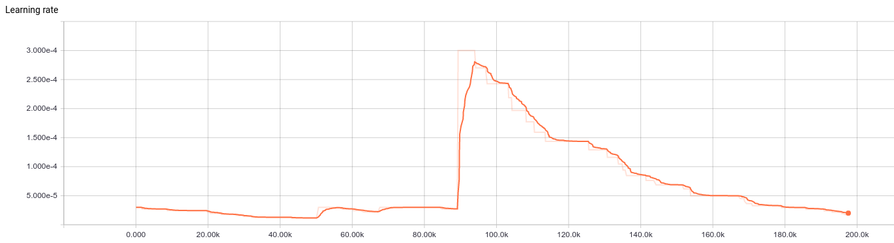
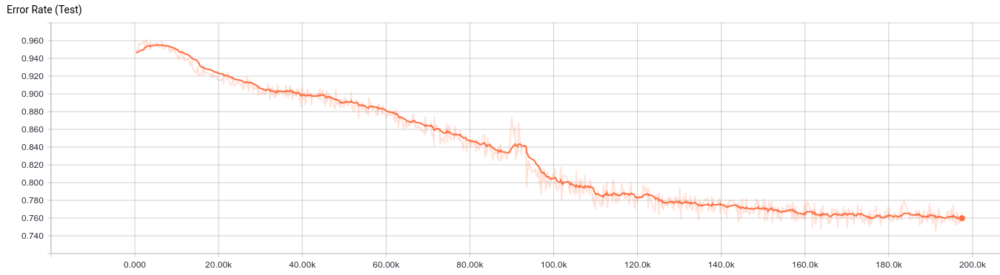
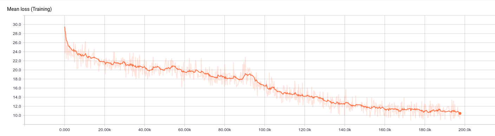

# English pre-trained model

This directory contain a trained english acoustic model (197.500 steps of 100 files batches).
This is still work in progress, far from perfect, but it give some insight on the current state of the software

### Dataset

The dataset was constructed using [Shtooka data](http://shtooka.net/)

Training set contains :
* eng-balm-verbs_flac.tar
* eng-wims-mary_flac.tar
* eng-balm-emmanuel_flac.tar
* eng-balm-judith_flac.tar
* eng-wcp-us_flac.tar
* eng-wims-mary-conversation_flac.tar

Test set contains :
* eng-balm-judith-proverbs_flac.tar

### How to try it
Make sure to set those parameters in your config file :

    [acoustic_network_params]
    num_layers : 2
    hidden_size : 768
    dropout : 0.5
    batch_size : 50
    learning_rate : 1e-3
    lr_decay_factor : 0.90
    grad_clip : 5
    
    [general]
    use_config_file_if_checkpoint_exists : False
    steps_per_checkpoint : 100
    checkpoint_dir : trained_models/acoustic_model/english_Shtooka
    
    [training]
    max_input_seq_length : 350
    max_target_seq_length : 40

Run the model on a "less than 3.5 seconds long" wav file of your choice

    python3 stt.py --file data/Shtooka/train/flac_6/En-us-target.wav

On this example file from the training set you will obtain 'tadlet' which is quite near 'target'

Note : the test set is really difficult and give poor result for now

### Reproduce the learning phase
Each tar files will create a "flac" directory by default, make sure to deflate the files one at a time and rename the directory to prevent overriding some files
Put the training data directories in a directory and set it in config file

    training_dataset_dir : data/Shtooka/train
    training_dataset_type : Shtooka

Put the test data in another directory and set it in config file

    test_dataset_dir : data/Shtooka/test
    test_dataset_type : Shtooka

Launch training and wait...

    python3 stt.py --train --tb_name Shtooka-full

Note : during the training of this model the learning rate was overridden a couple times because it was initiated with a too low value. You should start with a good learning rate '1e-3' or '3e-3' should be fine. If needed the training can be safely interrupted and relaunched. You can also override the learning rate if it drop too quickly.

### Training graphs

The learning rate was initialized too low (3e-5) so it was reset to a higher value (3e-4) at around 90.000 steps.

(this explain the bump on the error rate and loss respectively)

The error rate below is on the test set on which the rnn never train.
As indicated previously the test set on this example was to hard (english expressions with specifics difficulties) so the net result is not good at all : 0.760 means it gets a good char only 1 time in 4.
Anyway the shape of the graph demonstrates that the rnn correctly learn to recognize sounds of some letters.

The loss is dropping quite well.

