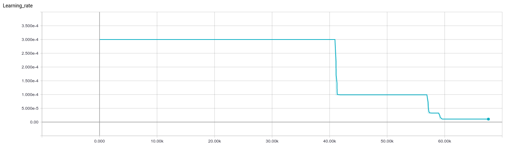
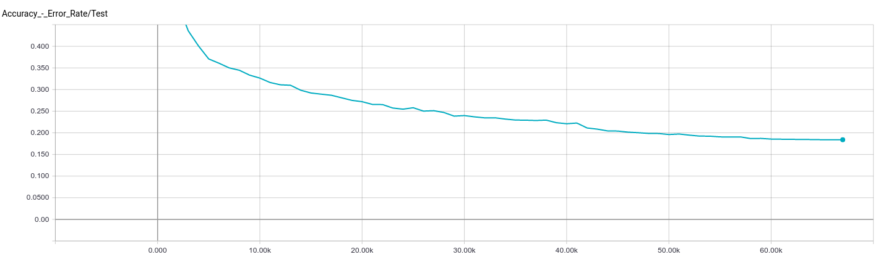
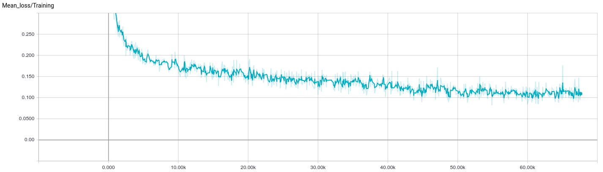

# English pre-trained model

This directory contain a trained english acoustic model : 67.600 steps of 30 files batches 
(3 mini-batchs of 10 files for each step).

__Warnings :__ 
* This model use 3 layers, default is 5 in config file
* Tensorflow's team _love_ to change names of variables. This pre-trained model is "name compatible" with tensorflow 1.3
and maybe the next versions... If your result is incorrect you should set log_level to DEBUG and check if the TF
variable names in the beginning of the log matches those listed in _add_saving_op in AcousticModel.py

Results on LibriSpeech's test-clean evaluation set (with max_input_seq_length : 3510):
* __CER : 15,2 %__
* __WER : 42,4 %__

### Dataset

The dataset was built using [Shtooka](http://shtooka.net/), [LibriSpeech](http://www.openslr.org/12/) and 
[TED-LIUM](http://www-lium.univ-lemans.fr/en/content/ted-lium-corpus) datasets

Training set contains :
* LibriSpeech's train-clean-100
* LibriSpeech's train-clean-360
* LibriSpeech's train-other-500
* Shtooka's eng-balm-emmanuel_flac.tar
* Shtooka's eng-balm-judith_flac.tar
* Shtooka's eng-balm-verbs_flac.tar
* Shtooka's eng-wcp-us_flac.tar
* Shtooka's eng-wims-mary_flac.tar
* TED-LIUM's release 2

Test set contains :
* LibriSpeech's test-clean

### How to try it
First check that you have downloaded the lfs managed files. Execute this command in project's root dir :

    $ git lfs pull

Then make sure to set those parameters in your config file :

    [acoustic_network_params]
    num_layers : 3
    hidden_size : 1024
    dropout_input_keep_prob : 0.8
    dropout_output_keep_prob : 0.5
    batch_size : 10
    mini_batch_size : 3
    learning_rate : 0.0003
    lr_decay_factor : 0.33
    grad_clip : 1
    signal_processing : fbank
    language : english
        
    [general]
    use_config_file_if_checkpoint_exists : True
    steps_per_checkpoint : 100
    steps_per_evaluation : 1000
    checkpoint_dir : trained_models/english
        
    [training]
    max_input_seq_length : 3510
    max_target_seq_length : 600
    batch_normalization : False
    dataset_size_ordering : False

Run the model on a "less than 15 seconds long" wav file of your choice

    $ python3 stt.py --file data/LibriSpeech/dev-clean/2086/149220/2086-149220-0007.flac

On this example file from Librispeech dev set that the model never trained on you will obtain :

    it now contained only shanetoclare his two wides and a solitary chicken

the original text being :

    it now contained only chanticleer his two wives and a solitary chicken

### Reproduce the learning phase
Put the training data directories in a "train" directory and set it in config file

    training_dataset_dirs : data/Shtooka/train, data/LibriSpeech/train, data/TEDLIUM_release2/train

Put the test data in another directory and set it in config file

    test_dataset_dirs : data/LibriSpeech/test

Launch training and wait...

    $ python3 stt.py --train --tb_name libri_shoota_TEDLIUM

### Training graphs

The learning rate was initialized at 0.0003.

The error rate below is on the test set on which the rnn never train.

The loss is dropping as expected.

